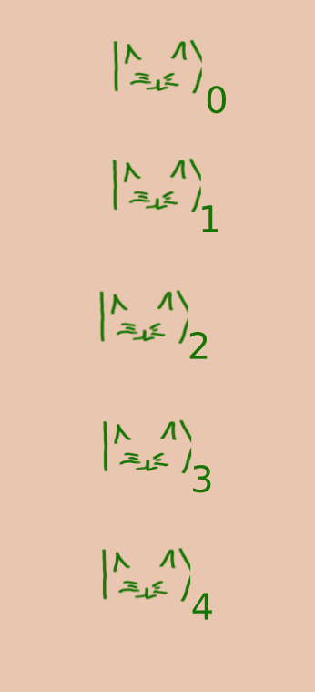
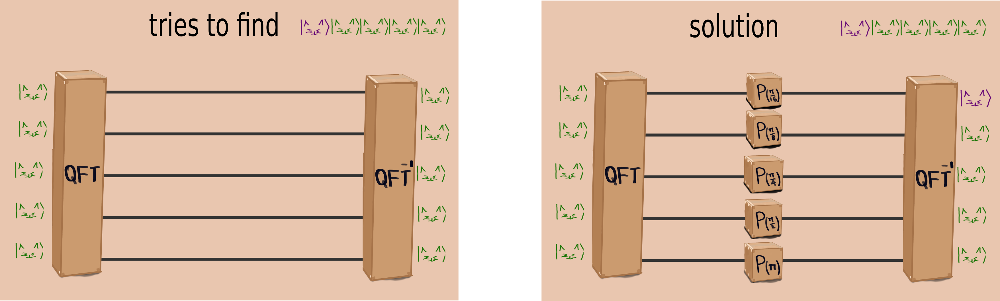
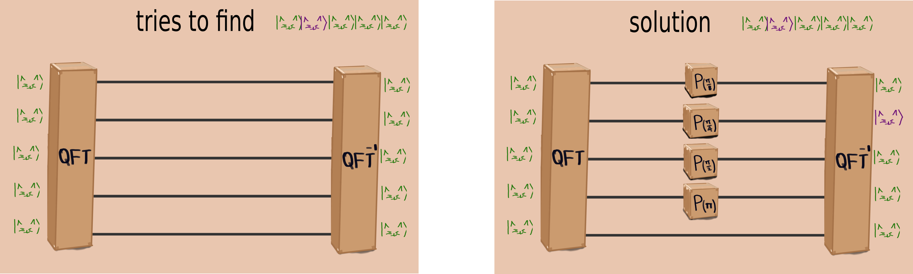
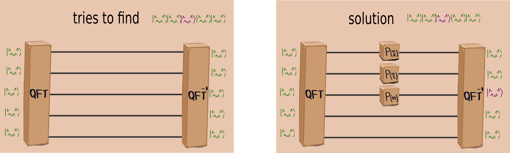
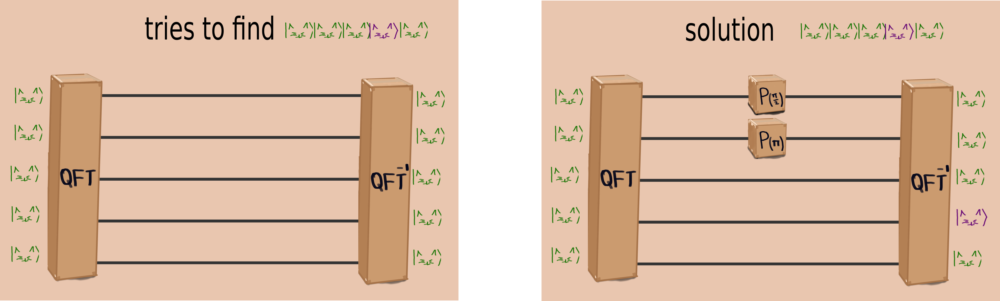
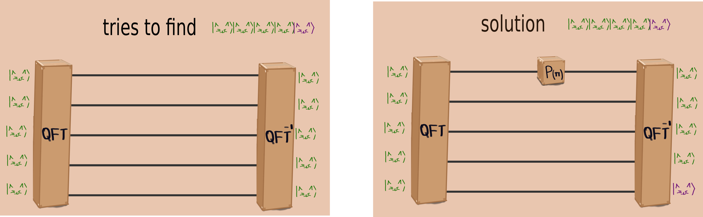

# QATS-quantum cats (QUQATS team)
#iQuHACK quantum computing video game

This videogame aims to learn how a quantum circuit works and to do additions and subtractions from Draper's method, as we believe that with an application can help people learn about quantum computation

We want to explain quantum con cepts with cats an boxes, try to teach quantum computing with quantum videogames and more fun with a real quantum comptuer

## Context Game

In a laboratory dedicated to problems of quantum mechanics they have 5 cats as pets, some are green and others are purple. One of the research experiments were in several boxes called QFT, QFT$^{-1}$ and P with certain dephase, one day when they left the cats they forgot to keep the boxes in a place where the cats could not see them, consequently the cats got into the boxes and when the researchers arrived they realized that the cats were green. In this game we must consider the proper way to arrange the boxes in such a way that we find the purple cats in a specific porden since they only know the number of the cat by the collar they wear. 

# Skill level: Beginner 
Understanding the phases of circuits and qubits
Anybody with any background can understand through problem solving how to create a circuit without being explicit with details
    
We start out with the cats in superpostion (green cats) which are the qubits.
We use the Draper Method for addition and subtraction. 
By using gates in the circuits we can change the color of the cats (i.e. the states of the cats).
The goal is to find the original cats(purple) from the changed cats(green).

## Rules

In order to find the right cats we have a certain number of boxes with a unique rotation.
You can choose to use more or less boxes depending on the structure of the circuit.
    
    
The following boxes in an unordered manner:

5 box with  𝑃(𝜋) 
4 box with  𝑃(𝜋2) 
3 box with  𝑃(𝜋4) 
2 box with  𝑃(𝜋8) 
1 box with  𝑃(𝜋16) 
Find the way to find the purple cats by following the structure , where the boxes must be arranged in a row order for the cats, it is also possible that not all boxes can be used.

You can select or not to put one or more boxes

- 5 box with  𝑃(𝜋) 
- 4 box with  𝑃(𝜋2) 
- 3 box with  𝑃(𝜋4) 
- 2 box with  𝑃(𝜋8) 
- 1 box with  𝑃(𝜋16)

# Hints

# QRNG
We  developed a QRNG and return a bitstring with the expect output, where

0 is equal a green cat
1 is equal a purple cat

# Another modality

There are two more considerations that if the purple cats are not the same as the ones we expect, then we must reconvert this,  we also have that the P-boxes can be positive or negative.

# Background theory

This porject works using the Draper idea of the adder, that using the Amplitude Amplification, The central idea behind amplitude amplification is to amplify the probability of a desired outcome occurring by performing a sequence of reflections. These reflections rotate the initial state closer towards a desired target state, often called a marked state, for this we use the Quantum Fourier Transform for identify the correct target state, with a specific order of a collection of $P(\lambda)$ gatesThis porject works using the Draper idea of the adder, that using the Amplitude Amplification, The central idea behind amplitude amplification is to amplify the probability of a desired outcome occurring by performing a sequence of reflections. These reflections rotate the initial state closer towards a desired target state, often called a marked state, for this we use the Quantum Fourier Transform for identify the correct target state, with a specific order of a collection of $P(\lambda)$ gates. 

Our goal is explain withthe videogame the following concepts:

- Qubit
- Quantum Circuit
- Quantum Gate
- Amplitude Amplification
- Quantum Fourier Transform
- Arithmetic Operations

# References 

- Preskill, John. (2018). Quantum Computing in the NISQ era and beyond. Quantum. 2. 10.22331/q-2018-08-06-79. 
- Draper, Thomas. (2000). Addition on a Quantum Computer. 
- Ruiz Pérez, Lidia & Garcia-Escartin, Juan Carlos. (2017). Quantum arithmetic with the Quantum Fourier Transform. Quantum Information Processing. 16. - 10.1007/s11128-017-1603-1. 
- https://docs.microsoft.com/en-us/azure/quantum/user-guide/libraries/standard/algorithms
- Suau, Adrien & Staffelbach, Gabriel & Calandra, H.. (2020). Practical Quantum Computing: solving the wave equation using a quantum approach. 
- https://docs.microsoft.com/en-us/azure/quantum/how-to-python-qdk-local 
- https://docs.microsoft.com/en-us/azure/quantum/user-guide/machines/noise-simulator#:~:text=You%20can%20modify%20the%20noise%20model%20used%20in,then%20access%20the%20noise%20model%20by%20using%20get_noise_model%3A 
- https://ionq.com/docs/get-started-with-qiskit 
- https://en.wikipedia.org/wiki/Pseudorandom_number_generator 
- https://docs.microsoft.com/en-us/azure/quantum/user-guide/libraries/standard/algorithms 
- https://docs.microsoft.com/en-us/azure/quantum/how-to-python-qdk-local 
